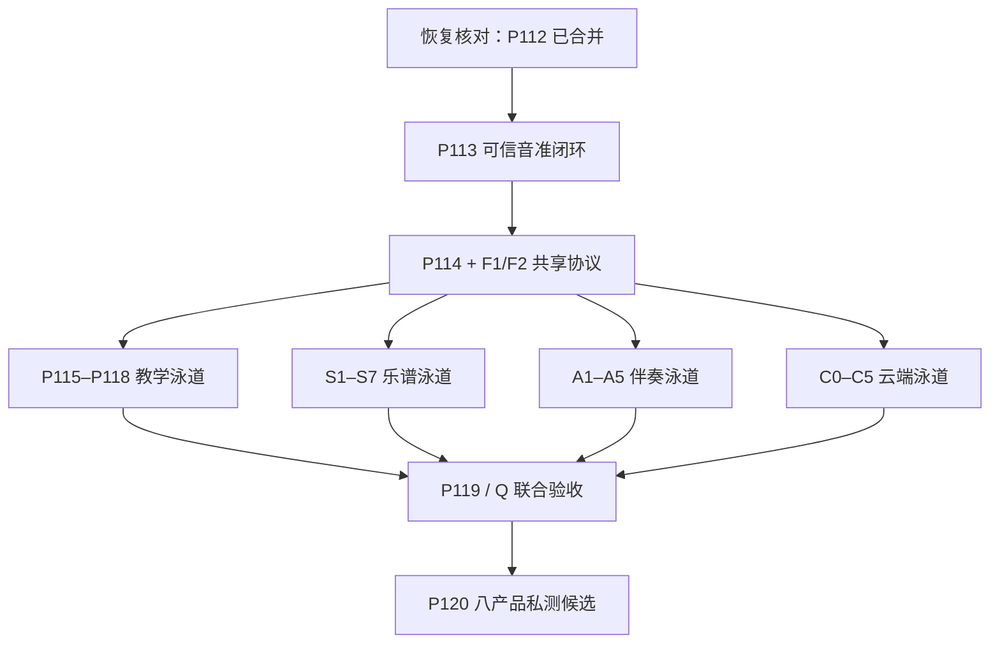

# 八产品全能音乐学习系统：未来开发执行路线（代码冻结规划版）

规划日期：2026-07-18
状态：**HISTORICAL EXECUTION BASELINE / 已由包含伙伴系统的统一路线接续**
当前检查点更新：P113 已通过 PR #365 squash merge，merge commit 为 `2a786f1b66fee095224214430d12e96f78a5057e`；项目在规划更新后暂停，下一运行时切片为 P114
适用项目：`aaaycc931-droid/my-first-app`

> 本文件保留 P/F/S/A/C/Q 原始范围和详细波次。P113 之后加入 AI 音乐伙伴 `M` 泳道的 canonical 执行顺序，以 `docs/unified-development-roadmap-with-ai-music-companion-2026-07-18.md` 为准；以下 P112/P113 暂停文字只作为历史创建背景。

## 1. 本次规划的授权边界

本节记录 2026-07-18 创建本规划时的历史授权边界；产品所有者随后已明确恢复运行时开发，当前状态以状态矩阵与 `docs/mvp-status.md` 为准。当时不执行以下动作：

- 不读取、修改或提交项目运行时代码；
- 不重开或改写已合并的 PR #363，不重跑其 CI；
- 不创建运行时开发分支、release 或 APK；
- 不安装或运行竞品 APK；
- 不把任何规划条目标记成已经实现；
- 不改变当前暂停状态。

未来只有在产品所有者明确说“恢复开发”后，才从远端最新状态继续。恢复时如主分支、状态矩阵或后续 PR 已发生变化，以远端事实为准并先报告，不按本文件的冻结快照强行推进。

## 2. 已冻结的产品范围

正式对标对象为八款：

1. 开嗓练声；
2. 知唱音域音调仪；
3. EarMaster；
4. 来音乐理；
5. 来音钢琴；
6. 来音伴奏；
7. 来音制谱；
8. 完美钢琴。

《练耳大师》明确不是目标，只保留为历史算法/交互基线。

最终产品原则：

- 每个核心模块都要达到优秀单项产品的核心体验，不靠“功能多”掩盖质量不足；
- 同一份谱、歌曲、录音、练习目标和学习画像贯穿各模块；
- 本地与云端都是最终范围，当前本地优先只是实施阶段；
- 安装包体积不是砍功能的理由；资源拆包用于更新、设备适配、许可和内存管理；
- 自动识别、生成和分析始终经过“预览 → 检查 → 修改/确认 → 再练习”；
- 未经数据、重复性和教育审核的结果继续使用非评分反馈；
- 不复制竞品代码、模型、音色、课程、题库、谱库、UI、图标或品牌表达。

## 3. 未来路线的终局定义

未来“完成”不等于八个功能入口都能打开，而是同时具备五个终局结果。

### 3.1 单项竞争力

- 钢琴用户可以只使用钢琴模块完成自由演奏、MIDI、录音、音色、谱面学习和练习反馈；
- 视唱练耳用户可以只使用活动、课程、定制、统计和反馈体系持续学习；
- 唱歌用户可以完成练声、音域、歌曲伴奏、跟唱、录音和逐句复练；
- 制谱用户可以创建、识别、编辑、播放、导入导出和恢复项目；
- 伴奏用户可以完成分离、多轨编辑、变调/变速、效果、分析和导出。

### 3.2 四条黄金闭环

1. **可信听唱闭环**：录音 → 本地高精度重分析 → 音符/句子对齐 → 证据反馈 → 分段复练；
2. **一份谱练到底**：导入/识别/创建 → 修改确认 → 播放 → 钢琴/视唱/节奏/听写 → 错误小节复练；
3. **一首歌练到底**：导入 → 分离 → 调性/BPM/和弦/段落 → 音域适配 → 跟唱/跟弹 → 逐句反馈；
4. **知识到能力闭环**：中文课程 → 听辨 → 看谱 → 唱/弹/写 → 解释错误 → 技能画像 → 定向复习。

### 3.3 本地与云端协同

- 断网时已下载的钢琴、基础练习、制谱、录音和本地项目可用；
- 登录和云端增强不阻断核心本地入口；
- 多端同步、内容更新、教师作业、复杂 OMR、多轨分离和重型分析由中国区合规服务逐步提供；
- 每个结果记录处理位置、算法/模型版本、内容版本、置信度和用户确认状态；
- 云端故障有明确降级，不静默上传、不静默覆盖、不丢本机项目。

### 3.4 可迁移、可导出、可删除

- 支持用户自有 MusicXML/MXL/MIDI、PDF/图片和音视频；
- 支持标准乐谱、MIDI、PDF/图片、音频、项目与学习摘要导出；
- 本地和云端数据都有清晰删除入口；
- 用户依赖来自协调效率，而不是封闭格式和数据锁定。

### 3.5 证据化发布

- 竞品对标必须由同机任务与合法黑盒数据证明；
- 钢琴、音准、OMR、伴奏、内容和云服务分别有质量报告；
- Debug、私测签名、CI、浏览器 QA、Android 真机、数据集与教育审核始终区分；
- 没有完成的能力必须显示“规划中/实验性/降级”，不能以路线文档冒充实现。

## 4. 编号与状态处理原则

### 4.1 保留现有 P113–P120 含义

不重新编号已经存在的 canonical 路线：

- P113：音符分段、目标对齐与逐音/逐句反馈；
- P114：统一练习活动协议与答案界面；
- P115：音程、和弦、转位、进行与音阶；
- P116：节奏专业套件；
- P117：旋律听写、回唱与视唱；
- P118：中文课程、统计与可解释自适应；
- P119：内容、算法与教育联合验收；
- P120：Android 专业私测候选。

### 4.2 新范围使用泳道编号

为避免在未核对远端前虚构 P121 以后编号，新能力先使用以下稳定泳道编号：

- `F`：共享基础与协议；
- `S`：乐谱工作台与 OMR；
- `A`：伴奏与歌曲练习；
- `C`：云端、内容与教师服务；
- `Q`：联合质量、竞品对标与发布。

正式恢复后，可在状态矩阵中把这些泳道映射为连续 P 编号；映射只改变编号，不改变范围、依赖和退出条件。

### 4.3 P119/P120 延后汇合

P119 和 P120 继续保留，但不得只等待 P118：它们还必须等待钢琴缺口、`S`、`A` 和必要的 `C` 切片汇合。

P120 的含义是“八产品范围明确的专业私测候选”，不是公开商店最终版。公开测试和正式发布还需要 P120 之后的受控私测、云服务可靠性、合规和真实用户证据。

## 5. 总体依赖图



钢琴 P106–P110 已合并。恢复时只读核对其运行时、自动测试与尚缺的真机/专业证据，作为 S/A/教学集成的基础；存在的证据或体验缺口建立“钢琴缺口闭环”切片并在 P119 前完成，不从头重做已通过部分。

## 6. 按波次推进的未来路线

波次代表依赖关系，不代表固定日历。满足依赖的泳道可并行；共享 schema 未冻结前不得并行制造互不兼容的数据模型。

### 波次 0：恢复与当前检查点闭合

触发条件：产品所有者明确要求恢复开发。

未来动作：

1. 从远端最新 main 只读核对 `AGENTS.md`、DoD、状态矩阵、最新交接和本路线；
2. 确认 P112 merge commit `a38d7be42b57e2bde4030e78d03a41f644897ee8` 仍在远端 main 历史中；
3. 核对 P106–P112 的运行时、自动测试、CI 与尚缺真机/教育/数据证据，不因“已合并”推定质量门槛全部通过；
4. 确认没有后来新增且尚未写入交接的分支或 PR；
5. 建立恢复后的滚动计划和泳道所有权。

退出条件：

- 当前 main、P112 合并事实和状态矩阵一致；
- 没有未说明的脏工作区、未提交用户改动或未知失败；
- 当前里程碑和下一切片写入交接；
- 只有此时才开始运行时开发。

### 波次 1：可信反馈与共享协议

#### P113：音符分段、目标对齐与反馈

完整交付：

- 把 P112 离线音高轨迹分割为音符/片段；
- 与目标节拍、音符和句子对齐；
- 输出音头、稳定段、尾音、cents 中位数/范围、节拍偏移、置信度和拒答原因；
- 用户从任意片段一键复练；
- 继续保持非评分边界。

退出条件：

- 合成、乐器、真实人声、静音、噪声、滑音、颤音和伴奏泄漏分层测试；
- 确定性、性能、迁移、删除和 Android 生命周期测试；
- 低置信局部拒答，不把目标先验强行吸附为正确；
- 第一个“录音—重分析—逐句证据—复练”黄金闭环可运行。

#### P114：统一活动协议与答案界面

完整交付：

- 版本化 `ActivityDefinition`；
- 选择、钢琴、五线谱、简谱/唱名、tap、麦克风、USB/BLE MIDI 答案适配；
- 题目预览、重听、作答、检查、解释、重试和定向复练状态机；
- 旧题目/结果迁移；
- 与 P113 的 `AnalysisEvidence` 对接。

#### F1：统一音乐时间与项目协议

接口在 P114 同期冻结，但不单独做空架构 PR。由首个使用者实现并测试：

- `MusicalTime`、tempo map、meter、tick/sample/monotonic time 转换；
- 标准 `NoteEvent`：note-on/off、velocity、pedal、channel、source；
- `ScoreDocument`、`PracticeTarget`、`MediaProject`、`AnalysisEvidence` 的最小版本；
- 来源、许可、算法版本、确认修订和迁移字段。

#### F2：资源与能力协议

- `ResourcePackage`：音色、模型、课程和题库的许可、版本、SHA-256、设备门槛和删除；
- `CapabilityResolver`：本地/云端/混合、地区、网络、设备、登录、授权和降级；
- 当前实现仍可全部指向本地 provider，业务模块不直接依赖具体服务。

波次退出条件：P113、P114 和共享协议冻结；后续三条功能泳道可以在不改核心语义的前提下并行。

### 波次 2：三条可独立留人的基础泳道

本波次最多并行三条运行时泳道，并保留一条证据/测试泳道。共享 schema 只由指定 owner 修改。

#### 教学泳道：P115

- 音程比较/识别/模唱；
- 三和弦、七和弦、转位、开放/密集排列；
- 和声进行、级数、终止式；
- 大小调、五声、教会调式和常见变化音阶；
- 三难度、定制集合、解释和教育审核批次。

#### 乐谱泳道：S1 可编辑乐谱基础

用户完整切片：新建一份谱 → 输入音符/休止 → 保存 → 播放 → 撤销/重做 → 再打开。

范围：

- `ScoreDocument` 正式持久化与迁移；
- part/staff/voice/measure/note 基础；
- 五线谱与简谱第一版；
- 谱号、调号、拍号、速度、音符/休止、附点、连音、歌词；
- 选择、移动、复制/粘贴、撤销/重做；
- FluidSynth/采样播放、节拍器与光标；
- 自动保存、空间不足与崩溃恢复。

#### 伴奏泳道：A1 音频项目基础

用户完整切片：导入音频/视频 → 看到波形 → 分段/循环 → 录一轨 → 保存 → 再打开 → 导出基础混音。

范围：

- 统一 PCM 解码与媒体来源保留；
- 非破坏 `MediaProject`；
- 波形、时间轴、片段、mute/solo、音量、淡入淡出；
- 新轨录音、自动保存、撤销/重做；
- 长文件、权限、音频焦点、存储失败和中断恢复。

#### 钢琴缺口核对

不预设重做 P106–P110。只按状态矩阵补真实缺口：

- 完美钢琴基线：单/双排、双人、和弦、键宽、标签、压力、插件、录音管理、USB MIDI、MusicXML；
- 来音钢琴基线：采样音色、谱库/课程、瀑布/掉音、左右手、速度/循环、USB/BLE/mic 输入与具体练习结果；
- 我方硬门槛：3 力度层、32/64 复音、10 指、P95 延迟、无卡音和逐音证据。

波次退出条件：教学、乐谱和伴奏各有一个能独立完成真实任务的切片；不是首页空入口。

### 波次 3：专业题型、完整谱种与本地分离

#### P116：节奏专业套件

- 视读、回模、找错、听写；
- tap、拍手/麦克风、MIDI；
- 预备拍、延迟校准、谱面编辑和逐拍非评分反馈；
- 节奏结果与 `ScoreDocument` 共享小节、拍点和时值。

#### S2：完整谱种与高级符号

- 五线谱、简谱、吉他/贝斯 tab、鼓谱、古筝谱、弹唱谱；
- 多 part、多谱表、多声部和分谱；
- 连音/延音、倚音、震音、琶音、装饰音、踏板、力度、反复、房子、指法、和弦；
- 吉他 capo/技法、古筝专用符号；
- 18 类以上原创模板；
- 页面、系统、换行/分页、标题/作者/版权和打印预览。

#### S3：标准格式导入导出

用户完整切片：导入 MusicXML/MXL/MIDI → 显示问题清单 → 修改确认 → 播放 → 导出 → 独立阅读器重新打开。

- MusicXML/MXL 为主交换格式；
- MIDI 导入/导出和量化选项；
- PDF、PNG/JPEG/SVG、WAV/MP3 与谱面视频导出；
- 全谱/分谱；
- MSCZ、OVE 等仅在合法公开规范/授权路径和 round-trip 证据通过后开放；
- 不支持元素显式列出，不静默丢失。

#### A2：本地 vocal/other 两轨分离

- 合法可分发模型与许可 manifest；
- 设备能力检测、模型下载/校验、进度、暂停/取消和恢复；
- vocal/other 预览与用户确认；
- 原音始终保留；
- 三档 Android 性能、内存、温度、电量和音质报告；
- 无账号、断网可用，绝不静默上传。

波次退出条件：一份标准谱可可靠往返；一首歌可在本地生成可编辑的两轨项目；节奏四件套闭环完整。

### 波次 4：旋律、智能输入、OMR 与多轨编辑

#### P117：旋律听写、回唱与视唱

- 五线谱/简谱/钢琴/唱名输入；
- 预备拍、节拍同步、实时曲线；
- 提交后 P113 分析、逐句反馈和分段复练；
- 无可靠输入、权限中断和模型不可用的恢复。

#### S4：MIDI 与音频转谱

- USB/BLE MIDI 实时记谱；
- 量化、节奏模式、声部估计、踏板和演奏噪声处理；
- 麦克风/音频产生音符候选；
- 原始事件、自动草稿和用户确认版本分别保存；
- 自动结果绝不直接覆盖正式谱。

#### S5：本地＋云端 OMR

- 本地页面质量、裁切、透视、谱表/区域检测和清洁印刷谱候选；
- 云端复杂多页、多谱表和更高质量 provider；
- PDF/图片/相机导入；
- 原图对照、逐符号置信度、批量修正和局部重识别；
- 取消、重试、离线队列、上传同意、保存期限和删除；
- 五线谱、简谱、中文歌词分别建立数据和门槛。

#### A3：多轨编辑与效果

- 分割、复制、移动、对齐、mute/solo、音量、声像；
- ±12 半音移调、50%–150% 不变调变速；
- EQ、压缩、限制、混响、降噪、淡入淡出；
- A–B、预备拍、节拍器；
- 全项目撤销/重做和确定性导出；
- 音高校正明确标为创作效果，不进入真实能力评价。

波次退出条件：用户能从纸谱、MIDI 或音频获得可检查草稿；伴奏项目达到独立工具的基本编辑完整度。

### 波次 5：课程系统、歌曲分析、同步与内容

#### P118：中文课程、统计与可解释自适应

- 至少 120 课节中文递进课程；
- 14 活动族、每族三难度和稳定题目/生成组合；
- 按技能、题型、难度和时间统计；
- 从错误直接进入定向复练；
- 建议显示原因，可关闭、重置和手动选择；
- 两名教师审核，题目和解释版本化。

#### S6：乐谱项目、版本与协作准备

- 本地版本历史、比较、恢复和分支副本；
- 全谱/分谱、文件夹、搜索、标签和来源/许可；
- OMR 原图、草稿、修订与确认版本关联；
- 教师批注和受控协作协议预留；
- 公开谱库和陌生人协作不在默认授权范围。

#### A4：歌曲调性、节拍、和弦与结构

- BPM、拍点、调性、和弦和段落的本地候选；
- 云端高质量候选接口；
- 置信度、版本、可编辑时间线和拒答；
- 根据用户音域提出移调建议；
- 变调后同步更新和弦、目标音、唱名与谱面草稿。

#### C1：可选账户与多端同步

- 当前本机身份平滑迁移为可选账户；
- 项目、设置、课程进度、技能画像和资源权益同步；
- 离线队列、幂等、删除传播、并发冲突、版本回滚；
- 登录失败或云端故障不阻断已下载核心功能。

#### C2：内容与资源平台

- 课程、题库、谱例、音色和模型包的审核、版本、灰度、撤回和增量更新；
- 来源、许可、SHA-256、兼容性和回滚；
- 下载内容断网可用；
- 不把用户普通练习录音默认作为训练数据。

波次退出条件：课程、谱面、伴奏和学习画像开始跨设备协同，同时核心本地体验仍可独立运行。

### 波次 6：四条黄金闭环汇合

#### S7：一份谱练到底

确认后的 `ScoreDocument` 一键进入：

- 钢琴谱面/瀑布/掉音；
- 左右手、速度、A–B、小节循环；
- 旋律视唱、回唱、节奏视读与听写；
- 参考音、练声和唱名；
- 错音、漏音、多弹、节奏和音准证据回写到练习副本；
- 从错误音符直接打开解释和复练。

#### A5：一首歌练到底

- 导入/分离后的歌曲项目；
- 调性、BPM、和弦、段落和音域适配；
- 分句歌词/谱面跟随、跟唱/跟弹、录音；
- P113 提交后逐音逐句分析；
- 弱句循环、自动移调、钢琴参考和课程建议；
- 可生成乐谱草稿并进入 S5 修正。

#### C3：云端高质量算法

- 复杂 OMR、多轨分离、重型音准/节奏/和弦分析；
- 质量、成本、地区、设备和隐私路由；
- 任务进度、取消、超时、重试、结果比较和删除；
- 本地/云端输出使用同一 schema，冲突不静默覆盖。

#### C4：教师与作业

- 课程编排、作业、谱面/音频批注和复练链接；
- 教师、学生、家长等最小必要角色与权限；
- 报告只使用有教育效度的指标；
- 未成年人、隐私和内容治理先通过评审再开放。

#### C5：运营可靠性与中国区合规

- 同意、审计、数据最小化、保存期限、导出和删除；
- 崩溃、性能、任务失败、配额、成本和服务降级；
- 备份恢复、客服诊断和区域灾备；
- 不把单一境外服务变成 Android 核心启动依赖。

波次退出条件：四条黄金闭环全部可运行，本地与云端协同有明确故障边界和用户控制。

### 波次 7：P119 / Q 联合验收

#### Q1：八款竞品同机任务

- 每款只比较其主打任务；
- 三档 Android、同输入、同环境、同版本；
- 记录完成率、时间、步骤、恢复、延迟、内存、温度和主观负担；
- 竞品输出不是算法真值。

#### Q2：算法与音频

- 音高：voiced F1、RPA/RCA、cents、八度错误、延迟、拒答和分层；
- 钢琴：触摸/MIDI 到声音、10 指、32/64 复音、延音、卡音、盲听；
- OMR：音高/时值 F1、小节、谱表/声部、歌词、符号、拒答和修正时间；
- 伴奏：SI-SDR/SDR 改善、残留、损伤、伪影、同步、处理时间和热降频；
- 所有报告冻结 commit、模型/参数、设备、系统、采样率和日期。

#### Q3：内容与教育

- 至少两名独立视唱练耳教师；
- 课程与题目抽样正确率 100%；
- 术语、唱名、难度递进、答案和解释审核；
- 正式分数另行完成重复性、公平性和阈值审批。

2026-07-24 执行检查点：P119a 已通过 PR #415 合并内容盘点与双教师审核证据协议；P119b 已通过 PR #417 把两个基础档各补到 20，使当前 30 个盘点组满足 V1 数量前置；P119c 已通过 PR #419 合并绑定 source commit、内容版本、18 个真源文件与 SHA-256 的可复核清单。产品所有者已确认两名独立教师在仓库外完成资质核验并分别签署，原样批准 P119d 的 30 层各 5 项、3 个课程项和共 153 个 item ID；5 组跨难度相同 variant 保留为难度递进配对审核项。获批批次继续冻结，逐题六维双教师审核与 finding 闭环延期到正式推广测试启动时。专业 40、抽样正确率与教育有效性仍为 `NOT_EXECUTED / BLOCKED`，不得由自动测试替代。

#### Q4：目标用户可用性

最低覆盖四类主要用户：唱歌/练声、视唱练耳/乐理、钢琴、制谱/伴奏。

- 每类至少 5 名目标用户完成本类核心任务；
- 再完成至少一条跨模块黄金闭环；
- 记录放弃点、错误恢复、理解成本和第二模块采用；
- 严重问题必须闭环复测，不用平均满意度掩盖任务失败。

#### Q5：安全、隐私与数据恢复

- 本地/云端删除、导出、同步冲突、账号退出、权限撤销；
- 录音、原谱、原音频和教师数据不泄漏；
- 空间不足、进程被杀、升级失败、服务不可用和模型损坏可恢复；
- 依赖、音色、模型、课程和谱例许可完整。

P119 退出条件：八产品矩阵中所有“必须”项均有运行时、自动测试、真机、数据或教育证据；未通过项不能进入 P120 的默认功能宣称。

### 波次 8：P120 八产品 Android 专业私测候选

完整交付：

- 稳定 release 签名、升级、回滚和迁移；
- 三档 Android 与核心外设矩阵；
- 本地、断网、弱网、登录、云服务故障和恢复；
- APK/资源包/版本/SHA-256/许可/构建摘要；
- 隐私同意、反馈导出、用户数据删除；
- 已知问题、实验性能力和降级说明；
- 四条黄金闭环的私测说明和最小操作路径。

P120 不是公开最终版。之后仍需：

1. 小规模封闭私测与问题闭环；
2. 扩大设备、网络、外设、内容和用户样本；
3. 云服务容量、成本、合规和灾备演练；
4. 分阶段公开测试；
5. 只有稳定留存、任务成功率和质量证据通过后，才定义正式 V1。

## 7. 八产品覆盖账本

| 对标目标 | 主要承接切片 | 在 P119 前必须证明 |
| --- | --- | --- |
| 开嗓练声 | P113、P117、P118、A4、A5 | 练声音型、发音方式、自动移调、课程/歌曲、录音和逐句复练 |
| 知唱音域音调仪 | P112、P113 | 打开即用、曲线/Hz/cents/音域/录音、稳定轨迹、拒答和提交后重分析 |
| EarMaster | P114–P118 | 14 活动族、课程、定制、多输入、统计、自适应、视唱/回唱/节奏闭环 |
| 来音乐理 | P114–P118 | 中文知识、题库、五度圈/和弦/音阶/术语、艺考/音基和多输入解释 |
| 完美钢琴 | P106–P110 缺口闭环、S7 | 88 键、单双排/双人/和弦、触控设置、插件、录音、MIDI、MusicXML、学习视图 |
| 来音钢琴 | P106–P110 缺口闭环、S3、S7 | 采样音色、课程/谱库、瀑布/掉音、左右手、循环、USB/BLE/mic 和具体错误定位 |
| 来音伴奏 | A1–A5、C3 | 分离、多轨、效果、变调/变速、歌曲分析、导出和练唱/练琴整合 |
| 来音制谱 | S1–S7、C1、C3 | 多谱种编辑、MIDI/音频输入、OMR、播放、导入导出、版本和练习整合 |

每次路线审查只允许三种状态：`未开始`、`有证据的部分完成`、`通过门槛`。不得使用“基本完成”“接近竞品”而没有证据链接。

## 8. 未来并行执行规则

恢复后采用滚动多泳道，但不是所有功能同时改共享代码。

### 8.1 推荐并行上限

- 1 条共享协议/迁移 owner；
- 2–3 条互不冲突的功能泳道；
- 1 条证据、设备或内容审核泳道；
- 子任务完成后立即释放并接下一项，不长期占用。

### 8.2 可并行组合

- P115 教学内容、S1 乐谱基础、A1 音频项目；
- P116 节奏、S2/S3、A2 分离；
- P117 旋律、S4/S5、A3 编辑；
- P118 课程、S6/S7、A4/A5、C1/C2；
- 数据采集、教师审核和三档设备准备可贯穿各波次。

### 8.3 不可并行冲突

- `MusicalTime`、`NoteEvent`、`ScoreDocument`、`PracticeTarget`、`AnalysisEvidence` 未冻结时，钢琴/制谱/活动不得各自造新 schema；
- 数据库迁移、项目格式和同步协议只由一个 owner 在同一时间修改；
- 音频设备/焦点/录音核心不允许钢琴、音准和伴奏分别同时重构；
- 同一用户流程不得由多个 PR 各加一半按钮而没有完整闭环。

## 9. 每个未来 PR 的 Strict Complete Mode

每个 PR 必须是完整、运行、可测试的 vertical slice，并至少包含：

1. 简体中文用户流程；
2. 正常路径与权限、存储、网络、设备、生命周期失败恢复；
3. 数据 schema、迁移、版本和删除；
4. focused tests 与受影响完整检查；
5. 真机/数据/教育证据计划，严格标记已执行与未执行；
6. 可访问性和横竖屏/小屏关键路径；
7. 性能、内存和资源预算；
8. 依赖、模型、音色、题目和内容许可；
9. 已知限制和诚实 UI；
10. 状态矩阵与交接更新。

不得作为独立里程碑的低价值切片：

- 只加一个入口或按钮；
- 只有 schema 没有真实使用者；
- 只有模型文件没有运行路径和质量报告；
- 只有营销文案或“功能已规划”；
- 把竞品截图、资源或字符串复制进产品；
- 为追编号而拆成不能独立使用的小 PR。

## 10. 阶段发布与用户价值

| 阶段候选 | 必须具备 | 主要验证对象 |
| --- | --- | --- |
| T0 可信听唱 Alpha | P113 完整闭环 | 知唱、开嗓、EarMaster 的音高/视唱基础体验 |
| T1 一份谱练到底 Alpha | S1–S5、S7＋钢琴缺口闭环 | 来音制谱、完美钢琴、来音钢琴用户 |
| T2 一首歌练到底 Alpha | A1–A5＋P113 | 开嗓、知唱、来音伴奏用户 |
| T3 中文完整课程 Alpha | P114–P118 | EarMaster、来音乐理用户 |
| T4 本地＋云端 Beta | C1–C5 的必要闭环 | 多端、内容、教师和复杂任务用户 |
| P120 八产品私测 | P119 全门槛通过 | 四类核心用户与跨模块采用 |

这些候选是内部/私测里程碑，不自动授权公开宣传“超过八款竞品”。

## 11. 停止、降级与回滚门槛

未来遇到以下情况必须停止当前切片继续扩张，先处理根因：

- 共享项目或时间协议产生不可逆数据损坏；
- 音频出现可复现卡音、常驻声源、录音丢失或导出错位；
- OMR、音高、歌曲分析在低置信时仍给出高置信错误；
- 云端在未经明确同意时上传录音、谱面或音频；
- MusicXML/MXL/MIDI 导入导出静默丢失已承诺元素；
- 模型、音色、谱例、题目或课程许可不清；
- 三档 Android 中目标设备普遍内存崩溃、热失控或无法安装；
- 内容/教师审核发现系统性错误；
- CI、签名、迁移或回滚无法证明安全。

安全降级原则：

- 关闭高成本混响、复音、力度层或重型模型时明确提示；
- 云端不可用回退本地或排队，不阻断项目打开；
- 模型不适配时拒绝运行并说明设备要求，不用错误输出填补；
- 自动草稿失败保留原文件和用户修改；
- 回滚不得删除新版本用户项目，必要时只读打开并提供导出。

## 12. 恢复开发时可直接使用的启动指令

```text
恢复开发，但不要重新开始。

先从远端最新 main 只读核对 AGENTS.md、正式 DoD、状态矩阵、最新交接、八产品竞争路线和未来开发执行路线。确认 P112 merge commit 与 P113 起点；如与规划不一致先报告。

在当前真实检查点之后采用 Fast Track + Strict Complete Mode。先闭合 P113，再冻结 P114 与共享音乐时间、NoteEvent、ScoreDocument、PracticeTarget、MediaProject、AnalysisEvidence 和本地/云端 provider 协议。随后按教学、乐谱、伴奏、云端泳道滚动并行，但共享 schema 和数据库迁移保持单 owner。

每个 PR 必须是完整可运行切片，执行实现 → focused tests → 完整检查 → 提交 → 推送 → PR → CI → 审查 → squash merge → 状态更新 → 下一优先级。不得把文档、按钮、模型文件或半条流程当成完成。

P119/P120 必须等待 P115–P118、钢琴缺口、S1–S7、A1–A5 和必要 C 切片汇合。保持简体中文、本地与云端双目标、自动结果先确认、低置信拒答、许可与隐私边界，并严格区分源码测试、CI、真机、数据集和教育审核。
```

## 13. 当前暂停点

本规划完成后继续暂停：

- 当前检查点记录为 P112 / PR #363 已合并，P106–P112 的真实证据仍按状态矩阵区分；
- 不开始 P113、P114、F、S、A、C 或 Q 的任何运行时工作；
- 除本次 docs-only 入库外，不操作运行时 CI、开发 PR、release 或 APK；
- 下一次只有产品所有者明确要求“恢复开发”才进入波次 0。
