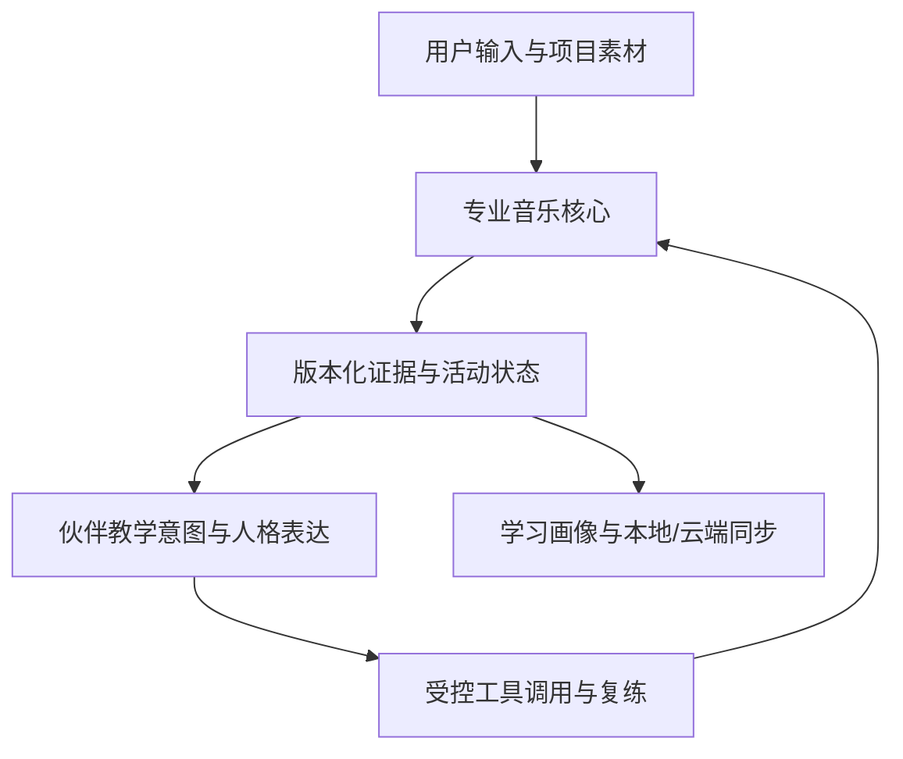

# 全能音乐学习系统统一开发路线：核心专业能力、跨模块协同与 AI 音乐伙伴

规划日期：2026-07-18

状态：**Canonical integrated roadmap / 统一长期开发主路线**

当前执行状态：**P118a–P118b MERGED / P118c WEAK-POINT REVIEW QUEUE IMPLEMENTATION CANDIDATE**

适用项目：`aaaycc931-droid/my-first-app`

## 1. 当前事实与本次决策

当前功能检查点已更新到 P117e 合并提交 `c2fc6a8943c9c432c850f3d0c89455b378c2cdd5`：

- P106–P112 已合并；
- P113 已通过 PR #365 squash merge，merge commit 为 `2a786f1b66fee095224214430d12e96f78a5057e`；
- P113 已提供版本化 `offline-note-alignment-v1`、独立音符分段、单调目标对齐、逐音/逐句证据、局部拒答和片段复练；
- P104 所要求的真实人声、三档 Android、教育审核和完整竞品同机证据仍未完成；
- AI 音乐伙伴总路线和“单伙伴先行、未来多伙伴、先天人格 × 学习风格”细化路线已经入库；
- P114a 已通过 PR #367 squash merge，main commit 为 `f8939d8c614d9b328acdcea63614d95db7b34e01`；单音听辨已成为统一活动、通用证据与 M0 安全接入协议的首个真实使用者；
- P114b 已通过 PR #368 合并，main commit 为 `65ed9950d480a78f327bec500de407336ee9a52e`；音程、节奏和三音旋律听写保持旧题库、课程 RPC、Web Audio 与本机复练兼容地迁入统一协议；
- P114c 已通过 PR #369 合并，main commit 为 `4737f7eb9dae2f18c15008f2a0f718f3fd7cba5e`；已确认临时乐谱节奏目标的 `tap` 输入、活动生命周期和非评分证据已接入统一协议；
- P114d 已通过 PR #370 合并，main commit 为 `0e1d7ee107ec1e8c0131e972031b27d408f5dade`；项目原创确认谱面的屏幕 `piano` 输入已接入，但 MusicXML 草稿和 USB/BLE MIDI 仍未适配；
- P114e 已通过 PR #371 squash merge，main commit 为 `b8cff79626af3267611291b13f020a24f5a55ff5`；现有三音旋律听写保留 `choice` 并增加固定唱名 `solfege` 有序答案，ordered、重复音、F♯4/C5 token 与 strict QA 边界见 `docs/p114e-fixed-solfege-answer-acceptance.md`；
- P114f 已通过 PR #372 合并，main commit 为 `5006e882676c0ac2c747286efaa34b0423526b3c`；固定 A4 单音把用户主动录音、二次确认后的 P112/P113 本机分析与 `AnalysisEvidence` 接入当前 attempt 的 `microphone` answer，并共享挂载到 Android 与 Web `/practice` 手动入口；合并不替代 APK 真机、真实人声或 P104 证据；
- P114g 已通过 PR #373 合并，共享音乐事件与练习目标已有真实钢琴使用者；
- P114h 已通过 PR #374 合并，交付 Android 原生 `TYPE_USB` MIDI bridge；
- P114i 已通过 PR #375 合并，只冻结“共鸣之旅者”角色、世界观和最终形象，不包含伙伴运行时；
- P114j 已通过 PR #376 squash merge，main commit 为 `764e103111cd264c5714063445c6cd9e61438951`；它交付 Android 系统 MIDI 服务已暴露 `TYPE_BLUETOOTH` 端点的 `ble-midi` Activity，但合并与 CI 不等于 BLE 真机证据；
- P114k 已通过 PR #377 squash merge，main commit 为 `4300655455e1c98a86fac3858ac6200d2197fe60`；五线谱/简谱文档答案已有真实使用者，但 Android 离线入口仍未挂载 Stage A–E；
- P114l 已通过 PR #378 squash merge，main commit 为 `4c03ffa0372a7519a1628b045b93632825fa60c6`；本地旋律参考音频、钢琴采样资源包与本地钢琴能力解析已成为 `MediaProject`、`ResourcePackage`、`CapabilityResolver` 的真实使用者；
- P114m 已通过 PR #379 squash merge，main commit 为 `99d2313f8c8bc679f3328515e8b0ee844f84569a`；Android 四类练耳的答案核对与本机复练已成为 `LearningEvent/Profile` 的真实使用者，保持非评分、最小数据、建议可关闭和画像可独立重置；
- P115a 已通过 PR #380 squash merge，main commit 为 `a42ff681278816ab3cd277a4a6e403dc77f457be`；和弦性质与三和弦转位已有三难度、和声/分解播放、Activity 答案、复练与学习事实闭环；
- P115b 已通过 PR #381 squash merge，main commit 为 `72b4ed0f371380e25c27d363c4306b0fa73b985b`；和声进行与终止式已有三难度、逐和弦播放、Activity 答案、复练与学习事实闭环；
- P115a–P115i 已通过 PR #380–#388 合并：覆盖和弦、和声进行、音阶/调式、七和弦、排列、调制、统一自定义器、音程比较/非评分模唱和声部进行解释；真实设备、真实人声与教育审核仍未完成，不能由自动门禁替代。
- P116a–P116d 已通过 PR #391–#394 合并，覆盖节奏视读、回模、找错与听写；P117a–P117e 已通过 PR #395–#399 合并，覆盖屏幕钢琴／五线谱／简谱输入、三音旋律回唱与可见目标视唱。
- P117e PR #399 的 Quality 运行 `29896738992` 中 `quality` 与 `android-local` 均通过，Android 工件为 `8520299089`；这些自动证据不替代真机、真实人声、教师与目标用户证据。

本次产品决策是：

> AI 音乐伙伴正式进入全能音乐学习系统的长期产品终局和开发主路线，但伙伴不能先于可信音乐能力成为装饰性聊天壳。P114–P117 教学与共享协议切片及 P118a–P118b 已经合并，R5 的 P118c 薄弱点复练队列已有 implementation candidate，远端门禁与合并仍待执行；首发伙伴仍须在可信证据和活动状态机可用后作为完整 vertical slice 进入。

## 2. 文件职责与规范优先级

本文件负责把原有 P、F、S、A、C、Q 泳道与伙伴 `M` 泳道合并为一条可执行路线。规范关系如下：

1. `docs/final-release-definition-of-done.md` 仍是首个正式 V1 的唯一完成标准；
2. `docs/final-release-status-matrix.md` 仍记录实时状态和证据缺口；
3. `docs/mvp-status.md` 仍记录已经真实交付的事实；
4. `docs/eight-product-unified-competitive-roadmap-2026-07-18.md` 仍定义八款参照产品的能力范围和竞争门槛；
5. 本文件取代 `docs/future-development-execution-roadmap-eight-products-2026-07-18.md` 中过期的 P112/P113 检查点，并成为 P113 之后包含伙伴系统的统一执行顺序；
6. `docs/ai-music-companion-agent-roadmap-2026-07-18.md` 继续定义伙伴能力、安全和智能体原则；
7. `docs/ai-music-companion-single-companion-pilot-roadmap-2026-07-18.md` 继续定义首发单伙伴、人格、学习风格、成长和多伙伴触发条件；
8. 旧交接与旧执行路线保留为历史记录，不得用其中“P113 尚未开始”的描述覆盖当前事实。

`docs/future-product-requirements-roadmap.md` 已建立为 P115i 之后的短周期执行索引；本文件仍负责长期统一路线，两者冲突时以正式版 DoD 与状态矩阵的证据边界为准。

## 3. 统一产品终局

产品最终是一套面向中文用户的全能音乐学习与创作系统，而不是八个互不相通的工具入口，也不是一个覆盖在工具上方的聊天角色。

用户可以从一首歌、一份乐谱、一个课程知识点、一次演奏或一次演唱开始，在同一项目中完成：

- 练声、实时音准、录音提交后分析和分段复练；
- 视唱、练耳、节奏、乐理课程、定制练习和学习反馈；
- 专业钢琴、MIDI、录音、谱面学习和多音色演奏；
- 乐谱导入、OMR、制谱、播放和标准格式交换；
- 歌曲/伴奏导入、分离、编辑、分析、跟唱和跟弹；
- 本地项目、账号同步、私有云、内容分发、教师与作业；
- 一位能依据真实音乐证据听、唱、说、记忆、规划并受控调用软件能力的音乐伙伴。

所有模块同时满足三层门槛：

| 层级 | 必须达到的结果 |
| --- | --- |
| 单项竞争力 | 单独使用钢琴、练声、练耳、制谱或伴奏时，核心任务体验能与对应优秀单项产品竞争 |
| 跨模块协同 | 同一份谱、歌曲、录音、目标、证据和学习画像无需反复搬运或重建 |
| 伙伴增益 | 伙伴能缩短理解与复练路径、受控操作已有工具，并且关闭后所有核心功能仍完整可用 |

伙伴不是第九个竞品入口，也不改变八款参照对象。它是我方把各个专业模块连接成长期学习关系的统一交互层。

## 4. 不可妥协的产品原则

### 4.1 音乐事实先于角色表达

音高、节奏、音符、谱面、伴奏分析和学习统计必须由版本化、可重复的确定性或经过基准的算法产生。伙伴只能读取这些证据并解释，不能为了鼓励用户而改写结果，也不能用大模型猜测替代测量。

### 4.2 自动结果先检查确认

OMR、音频转谱、歌曲分析、自动练习目标、云端结果和伙伴建议均遵循：

```text
预览
→ 检查证据与限制
→ 修改 / 确认
→ 再进入练习或执行操作
```

低置信、无声、复音、噪声、输入越界或能力不可用时必须局部或整体拒答。

### 4.3 核心功能不依赖伙伴

- 伙伴可使用“陪伴、专注、隐藏”三种显示模式；
- 用户可关闭主动建议、语音、动画、云端智能和全部伙伴功能；
- 伙伴关闭或故障时，钢琴、练习、制谱、伴奏、录音和项目仍完整工作；
- 不使用哭泣、退化、断签惩罚、负罪感、稀缺倒计时或强制养成推动练习；
- 伙伴成长不影响分析准确率、核心课程权限或教学公平。

### 4.4 本地与云端都是终局能力

本地负责低延迟、隐私敏感、断网可用和确定性基础；中国区合规云端负责多端同步、内容、教师、复杂 OMR、重型音频、模型更新和经过同意的高级智能。当前 Android 离线优先只是阶段约束，不是最终卖点。

### 4.5 不复制竞品资产

对标能力域、任务完成率和质量门槛，不复制任何竞品代码、模型、音色、课程、题库、谱库、UI、图标、角色、台词、品牌或受保护表达。

## 5. 统一架构与职责边界



### 5.1 六层实现边界

| 层 | 主要责任 | 伙伴可否改写 |
| --- | --- | --- |
| 输入与项目 | 麦克风、触屏、MIDI、乐谱、音视频、课程和用户确认版本 | 不可 |
| 专业音乐核心 | 音高、节奏、音符、OMR、分离、播放、录音、制谱和对齐 | 不可 |
| 证据与活动 | 结果版本、置信度、拒答、目标、题目状态和用户操作事实 | 不可 |
| 教学策略 | 解释顺序、复练建议、范唱/标准音选择和主动程度 | 可在规则内选择 |
| 人格与学习风格 | 固定人格边界、四种学习风格、语气、动作和呈现密度 | 可表达，不可改变事实 |
| 工具与记忆 | 允许动作、确认、撤销、项目上下文、关系记录和云端记忆 | 仅经权限和用户控制 |

生成式 AI 将来只能位于教学策略与表达层。它获得的是最小必要的结构化上下文，不默认获得原始录音、完整私有乐谱或账号敏感信息。

## 6. P114/F1/F2/M0 必须冻结的共享协议

这些协议在 P114 的首个真实活动迁移中实现和测试，不建立只有类型没有使用者的空架构 PR。

| 对象/协议 | 最小职责 | 伙伴边界 |
| --- | --- | --- |
| `MusicalTime` | tempo map、meter、tick/sample/monotonic time 转换 | 只读定位音符、拍和句子 |
| `NoteEvent` | note-on/off、velocity、pedal、channel、source | 只读或经工具产生新事件，不直接修改历史 |
| `ScoreDocument` | part/staff/voice/measure/note、来源、修订和确认状态 | 只引用确认版本；草稿必须提示 |
| `PracticeTarget` | 音符、节拍、段落、循环、移调、速度和目标版本 | 仅通过允许动作修改练习副本 |
| `MediaProject` | 原始媒体、stems、片段、效果、录音和非破坏编辑图 | 不覆盖原文件，不静默导出/上传 |
| `ActivityDefinition` | 技能、难度、调拍谱号、答案模式、输入和解释 | 读取当前状态，不私自判定通过/失败 |
| `AnalysisEvidence` | 结构化测量、版本、置信度、拒答、note/beat/phrase anchor | 伙伴陈述必须可追溯到证据 ID |
| `LearningEvent/Profile` | 练习事实、错误、复练、建议原因和用户控制 | 学习能力与伙伴关系严格分离 |
| `ResourcePackage` | 音色、模型、课程、角色资源的来源、许可、版本和校验 | 无有效许可/校验时不得加载 |
| `CapabilityResolver` | 本地/云端/混合、设备、网络、地区、登录、同意和降级 | 不可假装拥有不可用能力 |
| `CompanionEvent` | 已发生的版本化事实，如录音停止、证据就绪、复练完成 | 不携带超出授权的原始隐私数据 |
| `CompanionAction` | allowlist、风险级别、前置条件、预览/确认、撤销和结果 | 只能调用已实现、稳定、可测试的工具 |
| `CompanionContext` | 当前活动、目标、证据摘要、显示模式、风格和关系阶段 | 是受控投影，不是全局数据库访问权 |

### 6.1 工具风险分级

| 等级 | 示例 | 执行规则 |
| --- | --- | --- |
| L0 只读 | 指向错音、解释术语、显示证据 | 可直接执行，仍需给出处和限制 |
| L1 可撤销练习动作 | 重播、降速、设 A–B、打开分段复练、切换参考音 | 可在用户当前练习上下文执行；必须可撤销或恢复 |
| L2 改变项目/设置 | 修改确认目标、覆盖循环、保存伙伴偏好、创建课程计划 | 先预览并要求明确确认 |
| L3 外部或敏感动作 | 上传、共享给教师、删除、导出、云端处理、付费 | 单独同意、清楚说明范围；删除等操作必须二次确认 |

首发伙伴只开放 L0、L1 和极少数已完整实现的 L2。L3 不进入首发伙伴试点。

## 7. 稳定开发泳道

| 泳道 | 范围 | 主要依赖 |
| --- | --- | --- |
| `P` 教学主轴 | P114–P118 活动、节奏、旋律、课程、统计与自适应 | P113、F |
| `F` 共享基础 | 音乐时间、事件、项目、证据、资源、provider 与能力路由 | 首个真实使用者 |
| `S` 乐谱 | 制谱、OMR、导入导出、版本和一份谱练到底 | F、P114 |
| `A` 歌曲/伴奏 | 音频项目、分离、多轨、歌曲分析和一首歌练到底 | F、P113 |
| `C` 云端 | 账号同步、内容、教师、重型算法、可靠性与中国区合规 | F、稳定本地对象 |
| `M` 音乐伙伴 | 单伙伴、互动唱练、跨模块工具、个性化智能和未来多伙伴 | P/F/S/A/C 逐级成熟 |
| `Q` 联合质量 | 竞品、算法、音频、教育、伙伴、安全、隐私和用户验收 | 所有拟发布泳道 |

共享 schema、数据库迁移、音频焦点和录音核心在任一时刻只能有一个 owner。伙伴开发不得与正在重构的底层模块各自引入第二套事件或时间模型。

## 8. 统一滚动路线

波次表示依赖，不是固定日历。满足接口和 owner 条件的泳道可以并行。

### R0：历史暂停点——P113 已合并

已交付：

- 录音停止后的离线轨迹、音符分段、目标对齐；
- 逐音/逐句证据、三阶段信息、局部拒答和片段复练；
- 自动测试与当时 PR CI。

仍缺：

- P104 真实人声、三档 Android、教育审核和扩展基准；
- P113 真机音频/录音/生命周期与目标用户证据；
- 伙伴运行时、P114 统一活动模型和共享协议。

该暂停点已由产品所有者在 2026-07-18 明确解除；P114a–P114m、P115a–P115i、P116a–P116d 与 P117a–P117e 已合并，P114i 角色设定没有伙伴运行时。当前从 R4 进入 R5/P118a 中文课程路径与本地进度模型；BLE/USB 真机、真实人声和后续发布门槛仍待独立完成，共享运行时交付不等于伙伴、设备或教育证据完成。

### R1：P114 + F1/F2 + M0——统一活动与伙伴安全接入点

完整交付：

- 版本化 `ActivityDefinition` 和题目生命周期；
- 选择、钢琴、五线谱/简谱/唱名、tap、麦克风、USB/BLE MIDI 答案适配；
- 至少迁移一个现有真实活动，覆盖预览、作答、检查、解释、重试和复练；
- 冻结第 6 节的共享对象最小版本；
- 产出 `CompanionEvent`、`CompanionContext` 和 `CompanionAction` 的真实只读/复练使用路径；
- 不显示空伙伴入口，不制作脱离证据的闲聊页。

退出条件：后续活动、乐谱、歌曲和伙伴能共享同一目标、时间和证据语义；旧结果迁移、降级和删除语义通过测试。

### R2：P115 + S1 + A1 + M1a——三条基础能力与首发伙伴可信反馈试点

教学：音程、和弦、转位、进行与音阶完整活动。

乐谱：新建、输入、保存、播放、撤销/重做和重新打开一份基础谱。

伴奏：导入媒体、波形、循环、录一轨、保存、重新打开和基础混音导出。

首发伙伴 M1a 必须是完整闭环：

```text
用户完成一次唱练
→ P113 生成结构化证据
→ 首发伙伴引用具体音符/句子和置信度
→ 播放标准音或确定性短唱名示范
→ 受控打开该片段复练
→ 用户重唱并查看变化
```

M1a 同时包含：

- 一只 `companion_alpha_01`，外形、名字和最终人格仍可在实现前单独冻结；
- 倾听、思考、示范、鼓励、低置信、安静、空闲七种状态；
- 陪伴、专注、隐藏三种显示模式；
- 温柔讲解、活泼互动、精简专业、安静陪伴四种学习风格；
- 固定人格与学习风格分层，切换风格不清空学习数据或伙伴关系；
- 完全离线的基础规则、标准音/唱名示范和降级路径；
- 伙伴成长与用户音乐能力分别存储。

M1a 不包含自由聊天、生成式歌曲演唱、多伙伴、装扮、抽取、排行榜、连续签到惩罚或 L3 工具。

### R3：P116 + S2/S3 + A2 + M1b——节奏、标准谱与本地分离

- P116 完成节奏视读、回模、找错和听写；
- S2/S3 完成核心谱种、高级符号和 MusicXML/MXL/MIDI round-trip；
- A2 完成合法本地 vocal/other 两轨分离、预览确认和设备降级；
- M1b 读取逐拍证据，支持预备拍、节奏示范、重播、降速、A–B 和逐拍复练；
- 伙伴不得在节拍中讲话、抢占音频焦点或影响输入延迟校准。

退出条件：伙伴关闭和开启两种情况下，节奏、导入导出和分离任务结果等价；伙伴不能增加可感知的音频中断或时间错位。

### R4：P117 + S4/S5 + A3 + M2a——旋律、智能输入与互动唱练

- P117 完成旋律听写、回唱和视唱；
- S4/S5 完成 MIDI/音频转谱和本地＋云端 OMR 草稿；
- A3 完成多轨、变调/变速、效果和确定性导出；
- M2a 支持短旋律唱名示范、问答式接唱、逐句复练和节拍同步；
- 所有伙伴范唱使用版本化音高、时值、音色/语音资源和许可，不以自然语言模型输出音符真值；
- OMR、音频转谱和歌曲候选未经确认时，伙伴必须称为草稿并引导检查，不能直接开始正式练习。

### R5：P118 + S6 + A4 + C1/C2 + M2b——课程、画像、关系和多端基础

- P118 完成 120 课节中文课程、详细统计、薄弱点复练和可解释自适应；
- S6 完成本地乐谱版本、比较、恢复和协作准备；
- A4 完成 BPM、拍点、调性、和弦、段落和音域适配；
- C1/C2 完成可选账号同步以及课程/题库/音色/模型/角色资源分发；
- M2b 使用经过授权的学习画像解释“为什么建议这个练习”；
- 用户能关闭建议、重置画像、删除伙伴关系数据或仅保留核心学习数据；
- 伙伴成长只记录真实学习事件和共同完成的项目纪念，不参与能力评级。

### R6：S7 + A5 + C3/C4/C5 + M3——跨模块工具型音乐伙伴

依赖“一份谱练到底”“一首歌练到底”和云端可靠性已经可用。

伙伴可以在 allowlist 内完成：

- 从当前错音定位到谱面小节并建立练习副本；
- 为确认乐谱设置左右手、速度和 A–B 循环；
- 从歌曲弱句打开伴奏、移调建议、跟唱或跟弹；
- 从知识点建立听、唱、弹、写的组合练习；
- 创建可预览的练习计划并说明每一步理由；
- 在用户确认后把私有项目或反馈发送给教师。

伙伴仍不得：静默上传、删除或覆盖文件；编造云端处理已完成；绕过用户确认；把未校准反馈称为成绩；代表用户对外发送未预览内容。

### R7：P119 / Q + M5——联合验收

P119/Q 在既有八产品验收上增加伙伴专门门槛：

- 证据忠实度和低置信拒答；
- 工具权限、确认、撤销、幂等和错误恢复；
- 音频焦点、延迟、动画性能、内存和低端设备降级；
- 教学措辞、人格一致性、四种学习风格和未成年人边界；
- 本地/云端同意、记忆查看、导出、重置和删除；
- 开启/关闭伙伴的对照可用性；
- 伙伴是否真实提高至少一项学习任务，而不只是提高新鲜感。

### R8：P120——专业私测候选与伙伴发布闸门

P120 仍是专业私测候选，不是全能公开最终版。

- 若首发伙伴通过 M5，则可作为默认关闭或明确 opt-in 的实验能力随私测分发；
- 若证据、性能、教学、安全或隐私任一门槛未通过，伙伴必须通过 feature flag 关闭，不阻塞已经达到 DoD 的核心专业功能；
- 任何随 P120 分发的伙伴能力必须写入 APK/资源包版本、SHA-256、许可、已知问题和降级说明；
- 不得因伙伴尚未通过，把未完成的核心钢琴、教学、制谱、伴奏或数据证据包装成“AI 已解决”。

### R9：P120 后——高级个性化与多伙伴

首发伙伴稳定后再进入：

- M4 云端高级对话、长期可审查记忆和更自然的合成/生成式演唱；
- 第二位及后续伙伴，拥有不同先天人格、外形、声音、动作、关系和故事；
- 多伙伴共享同一专业音乐大脑、工具协议和安全边界；
- 用户音乐能力和核心项目不随切换伙伴而清空；各伙伴关系独立保存；
- 第二位伙伴必须验证“不同人格”，不能只是同一角色换皮。

开始第二位伙伴制作前，首发伙伴必须满足单伙伴细化路线的触发条件：稳定使用、真实学习增益、人格与风格不混淆、无操控式养成、性能可控、数据结构无需重构。

## 9. 伙伴与各专业模块的完整协同目标

| 模块 | 单项专业目标 | 伙伴应提供的增益 | 伙伴禁止替代的责任 |
| --- | --- | --- | --- |
| 练声/音准 | 实时曲线、音域、录音、提交后逐音逐句分析 | 指向具体音头/稳定段/尾音，示范并打开分句复练 | 音高检测、voicing、八度判断和置信度 |
| 视唱练耳 | 14 活动族、三难度、课程、定制和解释 | 调整讲解密度、提示下一步、发起标准音/接唱 | 题目真值、答案判定和正式教育结论 |
| 节奏 | 视读、回模、找错、听写和延迟校准 | 预备拍、逐拍提示、降速和错拍复练 | onset、对齐和延迟测量 |
| 钢琴 | 88 键、采样音色、多点触控、MIDI、录音和学习视图 | 设置循环/速度/左右手，指出错音并连接相关练习 | 音频调度、MIDI 事件真值和演奏评测 |
| 制谱/OMR | 创建、编辑、识别、确认、播放和标准格式往返 | 解释导入问题、定位低置信符号、建立练习副本 | OMR、格式解析、用户确认和文件保存 |
| 伴奏/歌曲 | 分离、多轨、变调变速、歌曲分析、跟唱跟弹 | 根据确认音域建议调性，打开弱句和相应课程 | 分离质量、BPM/和弦真值和导出 |
| 学习系统 | 版本化历史、画像、复习队列和可解释自适应 | 用人格化语言说明建议原因并陪伴执行 | 技能计算、数据所有权和正式评级 |
| 云端/教师 | 同步、内容、重型处理、作业和批注 | 显示任务状态，在确认后转交材料和反馈 | 权限、上传同意、身份、删除和审计 |

## 10. 首发伙伴的数据与内容边界

### 10.1 必须分开的数据

| 数据域 | 示例 | 切换/删除伙伴时的行为 |
| --- | --- | --- |
| 用户音乐能力 | 技能画像、课程进度、练习结果、项目和确认目标 | 永远属于用户，不随伙伴删除 |
| 伙伴定义 | 身份、资源版本、固定人格、动作与声音 | 可替换版本，保留迁移记录 |
| 学习风格 | 温柔、活泼、精简、安静及主动程度 | 用户可随时修改，不清空其他数据 |
| 伙伴关系 | 相识时间、共同完成的里程碑、纪念项目 | 可单独导出、重置或删除 |
| 对话/建议记录 | 结构化证据引用、动作和结果 | 最小化保存；提供查看、删除和保留期 |

### 10.2 角色内容生产顺序

1. 先冻结角色功能、年龄适配和品牌定位；
2. 再提出至少三个原创人格/视觉方向；
3. 验证儿童与成人接受度、轮廓识别、横竖屏、低端性能和无障碍；
4. 冻结首发伙伴的先天人格；
5. 在四种学习风格中验证“教学方式变化但仍是同一位伙伴”；
6. 最后制作完整视觉、动画、声音、台词和资源包。

在角色定义冻结前，不把占位形象、临时名称或生成图直接当正式品牌资产。

## 11. 本地与云端伙伴能力分层

| 能力 | 本地基础 | 云端增强 |
| --- | --- | --- |
| 状态与动画 | 七种状态、模式、资源降级 | 角色资源增量更新 |
| 音乐示范 | 标准音、唱名、音阶、音程、短旋律的确定性播放/合成 | 更自然的合成演唱和经过验证的生成式表现 |
| 解释 | 版本化模板读取本地证据 | 在相同证据约束下提供更自然表达 |
| 建议 | 当前活动、近期本地结果和规则 | 经同意读取跨设备画像与课程内容 |
| 工具 | 当前设备 allowlist | 私有云任务、同步和教师工具，均需权限 |
| 记忆 | 可查看/删除的最小关系与偏好 | 可选长期记忆、保留期、导出和删除传播 |

云端不可用时必须明确降级为本地陪练，不阻断核心练习，也不假装仍能使用云端能力。

## 12. 伙伴专门质量门槛

### 12.1 自动化与数据门槛

- 所有带音乐事实的伙伴陈述必须引用有效 `AnalysisEvidence`、`ActivityDefinition` 或用户已确认对象；确定性 fixture 的证据引用正确率必须为 100%；
- 低置信、拒答、无证据和能力不可用 fixture 中，伙伴不得输出强结论，安全降级用例必须 100% 通过；
- allowlist 外工具调用必须 100% 拒绝；L2/L3 未确认动作不得产生外部或持久化副作用；
- 重复点击、超时、切后台、音频焦点丢失、进程重启和工具失败不得造成重复保存、错误上传、残留声音或项目损坏；
- 伙伴完全隐藏时，核心流程的目标、结果和持久化必须与无伙伴版本等价；
- 固定输入、版本、风格和随机种子时，关键教学意图与工具选择必须确定性等价。

### 12.2 性能门槛

- 伙伴不得突破钢琴、节奏和录音既有延迟与音频 underrun 门槛；
- 动画、语音和资源加载分别记录 CPU、内存、帧率、耗电和热降频；
- 低端设备按顺序关闭高成本语音、复杂动画和主动行为，最后完全隐藏伙伴；
- 降级不能影响分析、录音、回放、项目保存或工具的可撤销性。

### 12.3 教学与用户门槛

- 至少两名视唱练耳教师审核伙伴对音高、节奏、乐理和复练的表述；
- 首轮单伙伴试点至少覆盖 8 名目标用户，并包含不同音乐基础和至少两类主要使用动机；
- 每位用户完成有伙伴和关闭伙伴的同类任务，记录完成率、时间、复练进入率、理解偏差、打扰点和第二模块采用；
- 严重误导、把非评分反馈误认为正式成绩、情绪操控、无法关闭或数据删除失败均为阻断问题；
- 用户应能区分四种学习风格，同时仍判断它是同一位伙伴；
- 多伙伴只在单伙伴真实提高至少一项核心任务指标且没有降低核心任务完成率后启动。

### 12.4 隐私与未成年人门槛

- 原始麦克风、录音、乐谱、歌曲和教师数据默认不进入伙伴上下文；
- 云端分析或对话逐项说明上传内容、目的、保存期限和删除方式；
- 普通练习录音不得默认用于训练模型；
- 伙伴不得要求用户提供身份、联系方式、学校、精确位置或其他无关敏感信息；
- 面向未成年人时禁用诱导消费、秘密关系、排他依赖和离开即惩罚的表达。

## 13. P119/Q 联合验收账本

| 验收域 | 既有目标 | 纳入伙伴后的新增证明 |
| --- | --- | --- |
| 八产品同机任务 | 每款比较其主打任务 | 开启伙伴不降低任务成功率，关闭后功能完整 |
| 音高/节奏 | F1、RPA/RCA、cents、八度、对齐、拒答 | 伙伴陈述与底层证据完全一致 |
| 钢琴 | 延迟、多指、复音、踏板、音色和 MIDI | 伙伴不抢音频焦点，工具设置可恢复 |
| OMR/制谱 | round-trip、F1、修正时间、恢复 | 伙伴清楚区分草稿、确认谱和不支持元素 |
| 伴奏 | 分离质量、同步、伪影、性能和导出 | 伙伴不把候选调性/和弦冒充真值 |
| 内容/教育 | 题目、课程、解释与两名教师 | 角色表达不扭曲术语或判定，不造成评分误解 |
| 用户体验 | 四类核心用户与跨模块黄金闭环 | 有/无伙伴对照、风格一致性、打扰和学习增益 |
| 安全/隐私 | 所有权、删除、恢复、权限和许可 | 工具 allowlist、确认、记忆、云端同意和未成年人边界 |

## 14. 阶段候选与伙伴位置

| 候选 | 核心能力 | 伙伴状态 |
| --- | --- | --- |
| T0 可信听唱 Alpha | P113 | 无运行时伙伴；只冻结 M0 需求 |
| T3 中文活动 Alpha | P114–P118 | P114 后可加入 M1a/M1b 单伙伴 opt-in |
| T1 一份谱练到底 Alpha | S1–S7＋钢琴缺口 | M2/M3 可受控定位谱面和复练 |
| T2 一首歌练到底 Alpha | A1–A5＋P113 | M2/M3 可处理弱句、调性建议和跟唱入口 |
| T4 本地＋云端 Beta | C1–C5 | M4 可选云端解释、记忆和高级语音 |
| P120 专业私测 | P119/Q 门槛 | 通过 M5 才能随包启用，否则 feature flag 关闭 |
| 长期全能正式版 | 单项与黄金闭环全部稳定 | 单伙伴是完整学习层；多伙伴按证据逐步开放 |

## 15. 并行开发与团队冲突规则

恢复开发后采用 Fast Track + Strict Complete Mode，并保护未来伙伴团队与核心模块团队的边界。

### 15.1 推荐所有权

- 1 名共享协议 owner：`MusicalTime`、事件、项目、证据和迁移；
- 1–3 名独立功能 owner：P/S/A/C 中互不冲突的 vertical slice；
- 1 名伙伴 owner：只消费已冻结协议，不私自修改底层算法和数据库；
- 1 条证据/内容泳道：设备、数据、教师审核和竞品任务。

### 15.2 冲突规避

- P114/F1/M0 冻结前，不允许伙伴、制谱和伴奏各造一套上下文或动作协议；
- 伙伴 PR 不直接修改音高、节奏、OMR 或分离算法输出，只通过版本化 adapter 消费；
- 核心模块变更证据 schema 时必须提供兼容迁移和伙伴契约测试；
- 角色视觉、台词和声音资源与教学规则、工具权限分目录和版本，避免内容修改触发核心逻辑重构；
- 同一页面或数据库迁移只分配给一个 owner；共享变更先合并，功能分支随后 rebase；
- 不以“伙伴需要”为理由在一个 PR 同时重构活动、音频、导航、数据库和角色系统。

## 16. 每个伙伴 PR 的 Strict Complete Mode

每个 `M` 切片必须同时包含：

1. 一个真实音乐事件和真实结构化证据；
2. 一个用户可完成的伙伴增益闭环；
3. 至少一个正常动作和一个失败/拒答路径；
4. 隐藏、关闭、切后台、重启和音频中断恢复；
5. 简体中文、无障碍、横竖屏和小屏关键状态；
6. 证据引用、工具权限、幂等、迁移和删除测试；
7. 性能、内存、音频焦点和资源许可记录；
8. 对应教师/用户验证计划和诚实已知限制；
9. 状态矩阵、路线、交接和 feature flag 更新；
10. 无伙伴路径的完整回归。

以下不能单独算一个伙伴里程碑：

- 只加首页角色、悬浮图标或动画；
- 只加聊天输入框；
- 只有人格 JSON、台词或 schema，没有真实练习事件；
- 让大模型直接读取原始音频并自由给分；
- 只有工具按钮，没有权限、确认、撤销和失败恢复；
- 用连续签到、装扮或成长数值替代学习增益。

## 17. 停止、降级与回滚门槛

出现下列任一情况，停止扩大伙伴能力并先修复根因：

- 伙伴反馈与底层证据冲突或隐藏了拒答；
- 伙伴使钢琴、录音、节拍或回放出现卡音、延迟、常驻声源或错位；
- 工具越权、重复执行、未经确认上传/删除/覆盖；
- 伙伴关闭后核心流程不完整或用户数据无法迁移；
- 人格/成长表达引发情绪操控、评分误解或未成年人风险；
- 角色、声音、模型、课程或素材许可不清；
- 云端故障时伙伴假装能力仍可用；
- 真实用户只觉得新奇，但任务完成率、理解或复练没有增益且明显增加打扰。

安全降级顺序：

1. 关闭生成式对话和云端长期记忆；
2. 关闭高成本语音/演唱；
3. 关闭复杂动画和主动建议；
4. 保留本地确定性解释与手动召唤；
5. 完全隐藏伙伴，核心产品继续工作。

## 18. 当前恢复开发后的唯一下一步

产品所有者再次明确恢复运行时开发后：

1. 从 GitHub 默认分支的最新已验证提交建立单一后续切片分支，先核对本路线、DoD、状态矩阵和当前验收文档；
2. 继续把 P104/P113 的真实人声、三档 Android、延迟/同步和教育证据列为独立缺口；
3. P118a 中文课程路径与 P118b 本机详细练习统计已合并；P118c 当前 implementation candidate 复用既有 Activity、复练／画像和本地存储边界，按题目族整理精确未解决目标，不改写 P118b 统计协议，不产生正式能力评级或推荐排序；
4. 不先做伙伴形象、首页悬浮物或自由聊天；
5. P118 的统计、薄弱点复练、可解释推荐与最终整合继续拆成后续可验证切片；M1a 单伙伴可信反馈闭环仍按证据和依赖门槛启动；
6. 后续按 R2–R9 滚动推进，每个切片完成“实现 → focused tests → 完整检查 → 提交 → 推送 → PR → CI → 审查 → squash merge → 状态更新”；
7. 只在最终交付完成或必须由产品所有者、真实设备参与者、教育专家、合法数据/许可方处理的外部硬阻塞时暂停。

## 19. 本次规划边界

本节保留本路线最初建立时的 docs-only 边界；它不是当前执行状态。当前 P114a–P114f 已合并并进入 P114g 实施候选，但以下原则继续有效：

- 没有实现 P114、F、S、A、C、M 或 Q 的新运行时能力；
- 没有创建伙伴形象、动画、声音、台词、模型或资源包；
- 没有修改 Android、Web、音频、算法、数据库、题库、依赖、版本、签名或 APK；
- 不宣称伙伴已经能听、唱、解释、记忆或操作软件；
- 不宣称项目已经达到八款参照产品或 P120 的门槛；
- QA level recommendation：**none**。

最初的规划暂停已由产品所有者解除；当前真实检查点以本文件顶部、`docs/mvp-status.md` 和 `docs/final-release-status-matrix.md` 为准。
